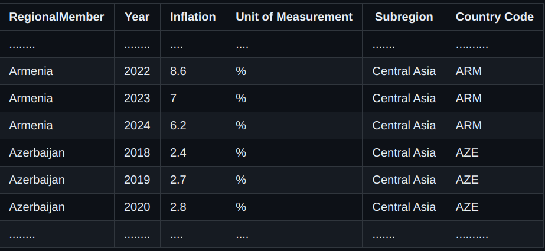

## Assignment 3 (File IO and LINQ)
You have csv data for inflation rate in Asia and the Pacific located Assignment 3\Inflation.csv. There are 6 data columns with few hundred rows. Data format looks like following:

Now your tasks are:

1. Create class Inflation with all column headers in csv file defined as properties
2. Create another class InflationAnalysis and define List<Inflation> asianPacificInflations collection as field.
3. Read csv text and populate asianPacificInflations collection looping through data read from the file
4. Write individual methods on InflationAnalysis tonswer following queries related to inflation:
  4. 1. Find inflation rates for countries for the year 2021.
  4. 2. A year when Nepal has highest inflation.
  4. 3. List top 10 regions (countries) where inflation is highest for all time
  4. 4. List top 3 south asian countries with lowest inflation rate for year 2020
Note: Please take snapshots as needed for your attempt progress (Code + Output).